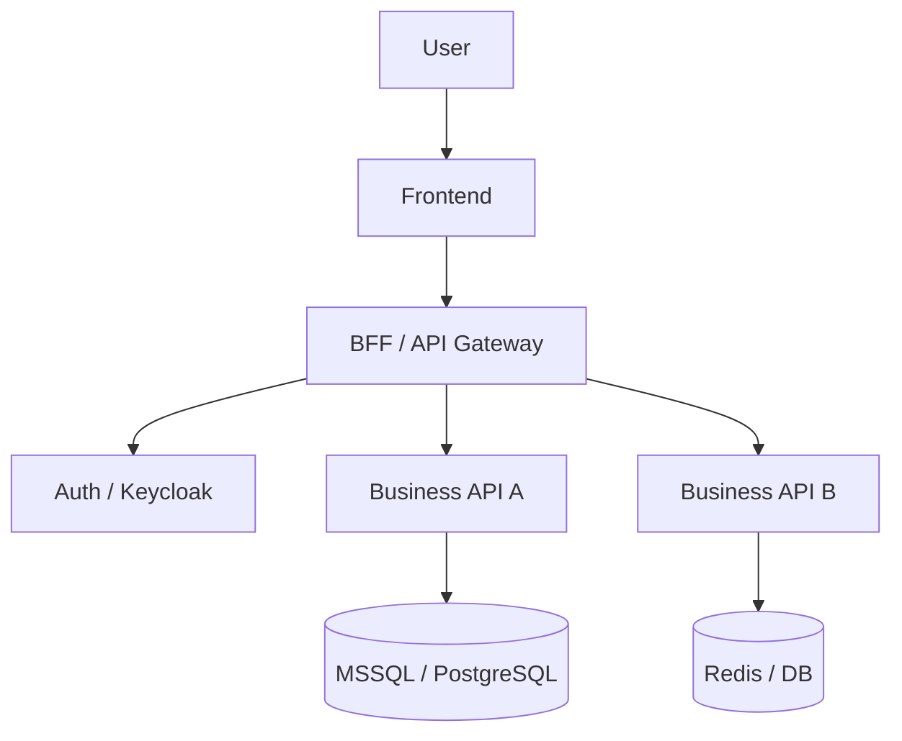
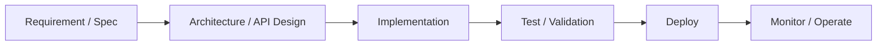
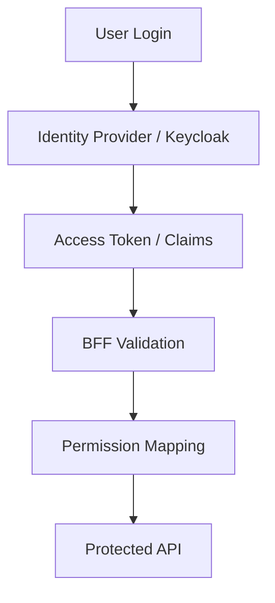

# Architecture

## How I Think About Systems

在設計系統時，我通常會從幾個面向思考：

1. 邊界與責任是否清楚
2. 權限與身份是否一致
3. 部署與維運是否容易
4. 擴充新模組時是否會破壞既有結構
5. 文件是否足夠支撐團隊協作

## Typical Architecture Focus

我常處理的架構主題包含：

- BFF / API Gateway
- 認證與授權整合
- 微服務與服務間通訊
- Gateway / Ingress / TLS
- CI/CD 與部署標準化
- 可維運性與文件化

## System Layering

## Delivery Flow

## Access Control Thinking

## Design Principles

- 清楚分層，避免責任混雜
- 權限邏輯集中管理
- 基礎設施與應用部署標準化
- 優先考慮長期維護成本
- 文件與圖表要能支撐交接與協作
