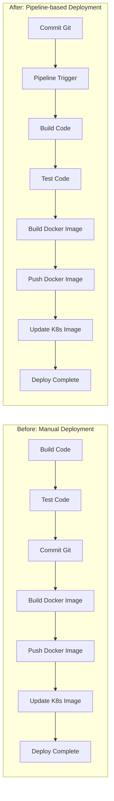

# Projects

## Project A - Enterprise Permission Platform

### Overview

建置企業系統的權限管理模組，整合 API 權限、角色、使用者屬性與 SSO。

### My Role

- 負責整體後端架構設計
- 設計權限模型與 API 對應方式
- 整合 Keycloak 與內部系統登入流程
- 協助部署與環境整合

### Tech Stack

- Azure 
- Azure DevOps
- Java / Spring Boot
- MSSQL
- Keycloak
- Kubernetes
- Istio

### Key Contributions

- 設計 API 權限映射機制
- 定義角色、模組、功能與 API 的關聯
- 建立可擴充的授權架構
- 降低前後端與多系統整合成本

### Outcome

- 權限模型覆蓋 N 個系統、100 支以上 API，跨系統授權規則一致化
- 新功能接入時間由 5 天降至 1 天（約下降 80%）

---

## Project B - Cloud Native Deployment Platform

### Overview

在 Kubernetes 環境中建立標準化部署流程，整合 Ingress、憑證、自動化與服務治理。

### My Role

- 規劃部署架構
- 建立 YAML / Helm 套件
- 處理 Gateway、TLS、流量導向與服務治理問題
- 協助排除跨環境部署與連線議題

### Tech Stack

- Azure 
- Azure DevOps
- Kubernetes
- Helm
- Istio
- cert-manager
- Azure

### Key Contributions

- 建立標準化部署模式
- 導入 HTTPS / 憑證自動化
- 規劃多個 Gateway 與流量入口
- 讓新服務更容易接入平台

### Outcome

- 單次部署時間由 45 分鐘降至 3 分鐘（約下降 93%）
- 部署步驟由 7 步簡化為 1 步，從手動執行 build、test、Docker 打包、image push 與 K8s 版本更新，改為提交 Git 後由 pipeline 自動完成，降低人為配置錯誤

### Deployment Flow

---

## Project C - AI-assisted Engineering Workflow

### Overview

將 AI 工具、文件規格、知識整理與開發流程結合，提升需求分析、設計與實作效率。
近期專案實務上採用 GitHub Spec-Kit 的 SDD（Spec-Driven Development）流程，
以 spec -> plan -> tasks 的結構，先對齊需求與驗收標準，再進入開發與驗證。
在 API 開發與前端對接過程中，針對溝通落差設計 `ui-contract.md` 規格格式，
並透過 Azure Pipeline 自動部署至 Kubernetes，提供前端可即時瀏覽的契約文件。
同時將 `ui-contract.md` 的撰寫流程封裝成 agent skill，供團隊以一致格式產出與維護文件。
另外將 GitHub Copilot 透過 MCP 串接開發機的 Kubernetes 與 Azure SQL，
讓 SDD 開發過程能直接參考實際環境資訊，提升產出程式碼與規格對齊的正確性。

### My Role

- 規劃 Spec / Plan / Tasks 工作流
- 整理開發文件模板
- 設計 AI 協作所需的 prompt / instructions / skills 結構
- 驗證不同工具在實務上的可行性

### Tech Stack

- Azure 
- Azure DevOps
- Markdown
- MkDocs
- GitHub Copilot
- MCP
- Kubernetes
- Azure SQL
- Local / Cloud LLM workflow
- Mermaid

### Key Contributions

- 建立可複用文件模板
- 導入 GitHub Spec-Kit SDD 流程（spec / plan / tasks）
- 將需求、設計、實作、驗收條件串成同一條可追溯鏈
- 設計 `ui-contract.md`（Route / API / Field Semantics / Error Mapping / Sequence）
- 將 `ui-contract.md` 封裝成 agent skill，提供團隊一致格式與撰寫方式
- ui-contract範例文件：[UI Contract - Create Order](ui-contract-order-create.md)
- 將 GitHub Copilot 透過 MCP 串接開發機 K8s 與 Azure SQL，提升 SDD 開發程式碼正確性
- 將ui-contract文件納入 Azure Pipeline，自動發佈至 K8s 供前端查閱
- 降低團隊對需求與架構理解落差
- 讓 AI 協作更貼近工程交付流程

### Outcome

- 規格文件產出時間由 4 小時降至 30 分鐘（約下降 88%）
- 單一功能前後端 API 對接會議次數由每功能 3 次以上降至 1-2 次
- 因需求理解落差造成的返工比例由 25% 降至 10%
- 文件查找與理解時間由 1-2 小時降至 10 分鐘
- 文件與ai skills覆蓋 6 個功能模組，提升知識重用率
