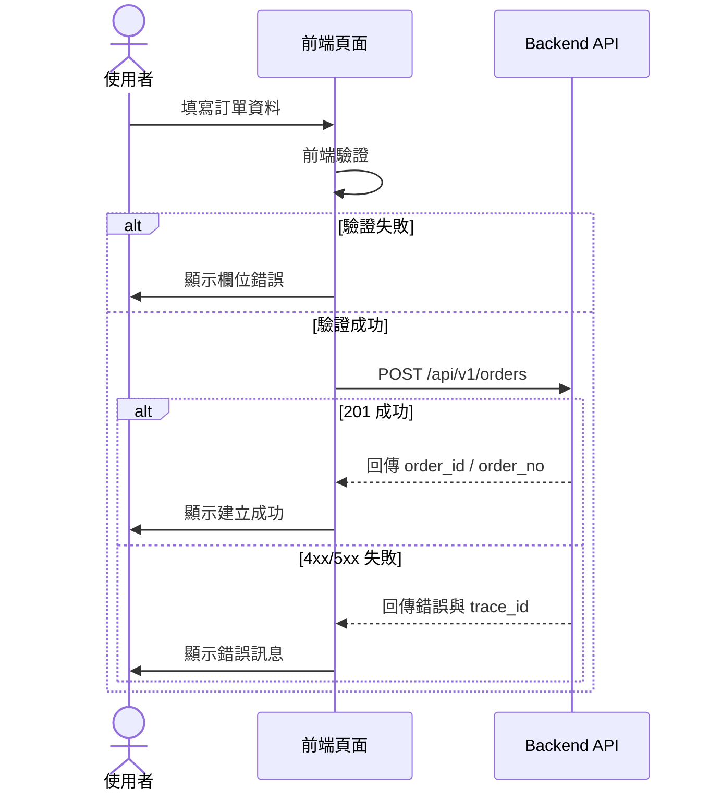

# 訂單建立頁面 (Create Order)

- UI Route: `/orders/create`
- UI API:
  - `GET /api/v1/customers` - 取得客戶清單
  - `GET /api/v1/products` - 取得商品清單
  - `POST /api/v1/orders` - 建立訂單
- Owner: Backend Team
- Version: 1.0.0
- Last Updated: 2026-03-15

---

## Request Contract

### 建立訂單 - Request Body

```json
{
  "customer_id": "00000000-0000-0000-0000-000000000001",
  "order_date": "2026-03-15",
  "currency": "TWD",
  "items": [
    {
      "product_id": "00000000-0000-0000-0000-000000000101",
      "qty": 2,
      "unit_price": 350
    },
    {
      "product_id": "00000000-0000-0000-0000-000000000102",
      "qty": 1,
      "unit_price": 1200
    }
  ],
  "remark": "Urgent delivery"
}
```

---

## Response Examples

### 建立成功 (201)

```json
{
  "code": "SUCCESS",
  "message": "order created",
  "data": {
    "order_id": "00000000-0000-0000-0000-000000009999",
    "order_no": "SO-20260315-0001",
    "customer_id": "00000000-0000-0000-0000-000000000001",
    "order_date": "2026-03-15",
    "currency": "TWD",
    "total_amount": 1900,
    "status": "DRAFT",
    "created_at": "2026-03-15 10:30:00",
    "created_by": "system_user"
  },
  "trace_id": "00000000-0000-0000-0000-00000000a001"
}
```

### 驗證失敗 (400)

```json
{
  "code": "ERROR_VALIDATION",
  "message": "invalid request",
  "errors": [
    {
      "field": "items[0].qty",
      "reason": "must be greater than 0"
    }
  ],
  "trace_id": "00000000-0000-0000-0000-00000000a002"
}
```

---

## Field Semantics Table

| 欄位名稱 | JSONPath | 型別 | 必填 | 驗證規則 | 備註 |
|---|---|---|---|---|---|
| 客戶 | `customer_id` | string(UUID) | 是 | 必須存在於客戶清單 | 下拉選單 |
| 訂單日期 | `order_date` | string(date) | 是 | `yyyy-mm-dd` | 預設今天 |
| 幣別 | `currency` | string | 是 | `TWD/USD/JPY` | 預設 `TWD` |
| 訂單明細 | `items` | array | 是 | 至少 1 筆 | - |
| 商品 | `items[*].product_id` | string(UUID) | 是 | 必須存在於商品清單 | - |
| 數量 | `items[*].qty` | integer | 是 | `> 0` | - |
| 單價 | `items[*].unit_price` | number | 是 | `>= 0` | 可由商品帶入 |
| 備註 | `remark` | string | 否 | 最多 200 字 | - |

---

## UI Behavior & Actions

| 操作 | 觸發方式 | API 呼叫 | 成功後行為 |
|---|---|---|---|
| 初始化頁面 | 進入 `/orders/create` | `GET /api/v1/customers`, `GET /api/v1/products` | 載入下拉資料 |
| 新增明細列 | 點擊「新增品項」 | - | 新增一列可編輯明細 |
| 刪除明細列 | 點擊「刪除」 | - | 移除該列並重算總額 |
| 送出訂單 | 點擊「建立訂單」 | `POST /api/v1/orders` | 跳轉訂單詳情頁並顯示成功訊息 |

---

## Error Mapping

| HTTP Status | Error Code | 發生情境 | UI 處理方式 |
|---|---|---|---|
| 400 | `ERROR_VALIDATION` | 欄位驗證失敗 | 顯示欄位錯誤 |
| 404 | `ERROR_CUSTOMER_NOT_FOUND` | 客戶不存在 | 提示並要求重選 |
| 404 | `ERROR_PRODUCT_NOT_FOUND` | 商品不存在 | 提示並移除無效品項 |
| 409 | `ERROR_PRICE_CHANGED` | 價格已更新 | 顯示差異並要求確認 |
| 500 | `ERROR_INTERNAL` | 系統錯誤 | 顯示通用錯誤，附 `trace_id` |

---

## Workflow / Sequence


